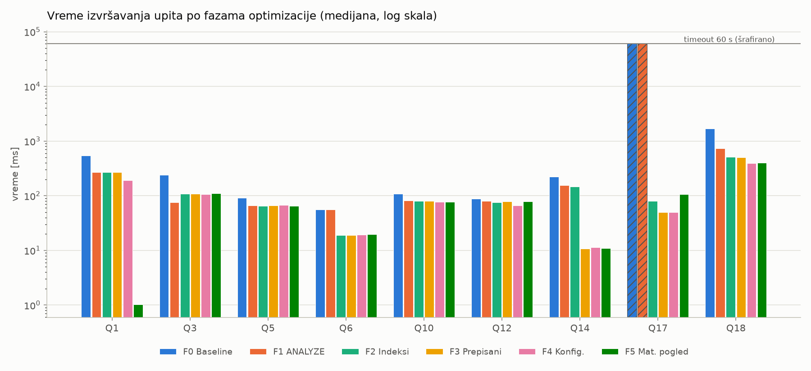
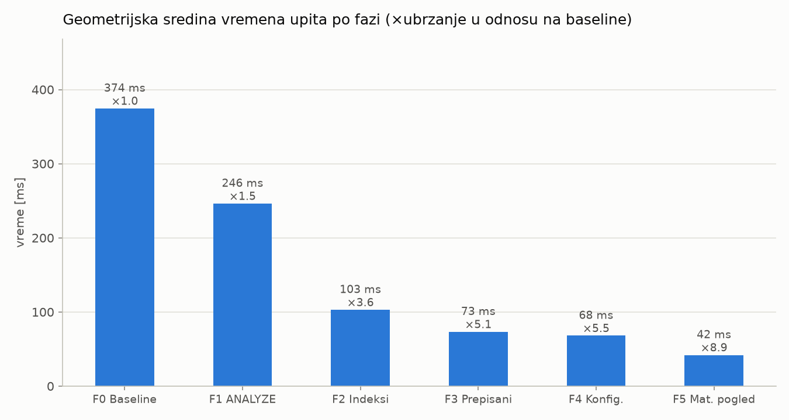
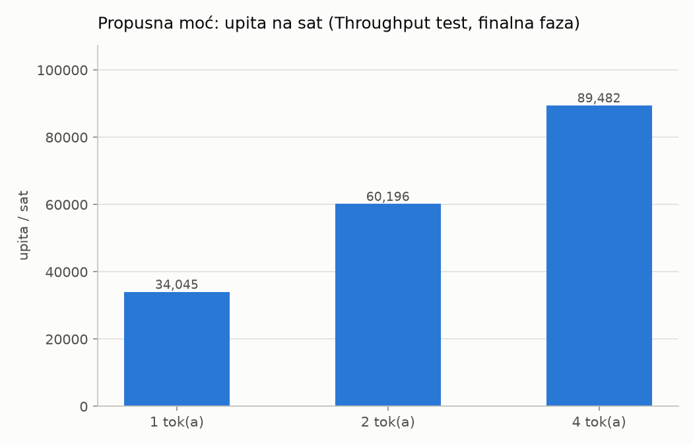

# Optimizacija upita primenom TPC-like benchmarking pristupa - rezultati

Datum: 30.09.2026 00:49 · PostgreSQL 18.4 · SF = 0.3 · 3 merenja po upitu (medijana, posle 1 zagrevanja) · timeout 60 s

## 1. Podaci

| tabela | broj redova | veličina |
|---|---|---|
| region | 5 | 8.0 kB |
| nation | 25 | 8.0 kB |
| supplier | 3,000 | 488.0 kB |
| part | 60,000 | 10.2 MB |
| partsupp | 240,000 | 26.8 MB |
| customer | 45,000 | 6.8 MB |
| orders | 450,000 | 52.5 MB |
| lineitem | 1,800,001 | 251.5 MB |

Vreme generisanja podataka: 11.1 s

## 2. Faze optimizacije

- **Faza 0 - Baseline**: Tabele bez PK/indeksa, bez statistike (autovacuum isključen), podrazumevana konfiguracija.
- **Faza 1 - ANALYZE - statistika**: ANALYZE prikuplja statistiku (histogrami, MCV, n_distinct) - optimizator bolje procenjuje kardinalnost.
- **Faza 2 - Indeksi**: PK, FK, indeksi nad FK kolonama, indeks za filter po datumu, pokrivajući i kompozitni indeks + VACUUM.
- **Faza 3 - Prepisivanje upita**: Q14: funkcija nad kolonom -> opseg (sargable); Q17: korelisani podupit -> JOIN sa preagregacijom.
- **Faza 4 - Podešavanje konfiguracije**: work_mem=256MB, max_parallel_workers_per_gather=4, random_page_cost=1.1, jit=off.
- **Faza 5 - Materijalizovani pogled**: Q1 čita unapred agregirane podatke po danu iz materijalizovanog pogleda.

## 3. Procena kardinalnosti pre i posle ANALYZE

| predikat | stvarno | procena bez statistike | procena posle ANALYZE |
|---|---|---|---|
| `lineitem: l_returnflag = 'R'` | 445,031 | 3,218 (×138.3) | 447,000 (×1.0) |
| `lineitem: l_shipdate BETWEEN DATE '1995-09-01' AND DATE '1995-09-30'` | 22,303 | 3,218 (×6.9) | 22,543 (×1.0) |
| `orders: o_orderpriority = '1-URGENT' AND o_orderdate >= DATE '1997-01-01'` | 21,710 | 235 (×92.4) | 21,453 (×1.0) |
| `customer: c_mktsegment = 'BUILDING'` | 9,011 | 61 (×147.7) | 8,970 (×1.0) |

## 4. Vreme izvršavanja upita (medijana)

| upit | F0 Baseline | F1 ANALYZE | F2 Indeksi | F3 Prepisani | F4 Konfig. | F5 Mat. pogled | ubrzanje |
|---|---|---|---|---|---|---|---|
| Q1 | 543.1 ms | 267.8 ms | 268.5 ms | 267.3 ms | 191.6 ms | 1.0 ms | ×532.4 |
| Q3 | 241.1 ms | 75.7 ms | 108.7 ms | 108.2 ms | 107.0 ms | 109.6 ms | ×2.2 |
| Q5 | 91.0 ms | 65.9 ms | 65.5 ms | 65.8 ms | 67.5 ms | 64.9 ms | ×1.4 |
| Q6 | 56.3 ms | 56.1 ms | 18.9 ms | 18.9 ms | 19.4 ms | 19.6 ms | ×2.9 |
| Q10 | 109.0 ms | 81.3 ms | 79.9 ms | 79.9 ms | 77.7 ms | 77.4 ms | ×1.4 |
| Q12 | 87.8 ms | 79.4 ms | 75.1 ms | 78.3 ms | 66.5 ms | 77.8 ms | ×1.1 |
| Q14 | 221.2 ms | 155.0 ms | 146.8 ms | 10.7 ms | 11.4 ms | 11.0 ms | ×20.0 |
| Q17 | >=60.0 s | >=60.0 s | 79.7 ms | 50.0 ms | 49.8 ms | 106.9 ms | >=×561.2 |
| Q18 | 1698.9 ms | 739.0 ms | 507.4 ms | 504.1 ms | 395.4 ms | 398.7 ms | ×4.3 |
| geomean | 374.5 ms | 246.2 ms | 102.9 ms | 73.3 ms | 68.0 ms | 41.9 ms | ×8.9 |
| Power-like | 2,884 | 4,387 | 10,500 | 14,744 | 15,884 | 25,746 |  |

`>=` označava upit koji je prekoračio timeout (stvarno vreme je veće). Power-like = 3600 · SF / geomean[s].

### Regresije

Upiti koji su u nekoj fazi postali sporiji za više od 20% u odnosu na prethodnu fazu (optimizacija koja pomaže većini upita može da pogorša pojedinačne - zato se svaka promena proverava benchmarkom):

| upit | pre | posle | planovi |
|---|---|---|---|
| Q3 | F1 ANALYZE: 75.7 ms | F2 Indeksi: 108.7 ms | `planovi/faza1_Q3.txt vs planovi/faza2_Q3.txt` |
| Q17 | F4 Konfig.: 49.8 ms | F5 Mat. pogled: 106.9 ms | `planovi/faza4_Q17.txt vs planovi/faza5_Q17.txt` |

## 5. Broj pročitanih blokova (shared hit + read, korenski čvor plana)

| upit | F0 Baseline | F1 ANALYZE | F2 Indeksi | F3 Prepisani | F4 Konfig. | F5 Mat. pogled |
|---|---|---|---|---|---|---|
| Q1 | 32,255 | 32,195 | 32,195 | 32,195 | 32,209 | 64 |
| Q3 | 41,597 | 41,523 | 187,315 | 187,315 | 187,285 | 187,285 |
| Q5 | 41,695 | 41,687 | 65,579 | 65,579 | 65,579 | 65,579 |
| Q6 | 32,181 | 32,181 | 1,643 | 1,643 | 1,643 | 1,645 |
| Q10 | 39,776 | 41,496 | 41,040 | 41,040 | 79,262 | 79,262 |
| Q12 | 38,909 | 38,909 | 38,909 | 38,909 | 69,637 | 69,637 |
| Q14 | 33,486 | 33,486 | 33,486 | 1,443 | 1,443 | 1,443 |
| Q17 | - | - | 94,362 | 38,422 | 21,291 | 21,291 |
| Q18 | 137,984 | 137,927 | 125,300 | 126,167 | 71,942 | 71,942 |

## 6. Cena optimizacije

| faza | naredba | trajanje |
|---|---|---|
| F1 | `ANALYZE region` | 0.00 s |
| F1 | `ANALYZE nation` | 0.00 s |
| F1 | `ANALYZE supplier` | 0.01 s |
| F1 | `ANALYZE part` | 0.17 s |
| F1 | `ANALYZE partsupp` | 0.08 s |
| F1 | `ANALYZE customer` | 0.16 s |
| F1 | `ANALYZE orders` | 0.12 s |
| F1 | `ANALYZE lineitem` | 0.18 s |
| F2 | `ALTER TABLE region ADD PRIMARY KEY (r_regionkey)` | 0.00 s |
| F2 | `ALTER TABLE nation ADD PRIMARY KEY (n_nationkey)` | 0.00 s |
| F2 | `ALTER TABLE supplier ADD PRIMARY KEY (s_suppkey)` | 0.00 s |
| F2 | `ALTER TABLE part ADD PRIMARY KEY (p_partkey)` | 0.14 s |
| F2 | `ALTER TABLE partsupp ADD PRIMARY KEY (ps_partkey, ps_suppkey)` | 0.14 s |
| F2 | `ALTER TABLE customer ADD PRIMARY KEY (c_custkey)` | 0.01 s |
| F2 | `ALTER TABLE orders ADD PRIMARY KEY (o_orderkey)` | 0.08 s |
| F2 | `ALTER TABLE lineitem ADD PRIMARY KEY (l_orderkey, l_linenumber)` | 0.43 s |
| F2 | `ALTER TABLE nation ADD FOREIGN KEY (n_regionkey) REFERENCES region` | 0.00 s |
| F2 | `ALTER TABLE supplier ADD FOREIGN KEY (s_nationkey) REFERENCES nation` | 0.00 s |
| F2 | `ALTER TABLE customer ADD FOREIGN KEY (c_nationkey) REFERENCES nation` | 0.00 s |
| F2 | `ALTER TABLE partsupp ADD FOREIGN KEY (ps_partkey) REFERENCES part` | 0.02 s |
| F2 | `ALTER TABLE partsupp ADD FOREIGN KEY (ps_suppkey) REFERENCES supplier` | 0.01 s |
| F2 | `ALTER TABLE orders ADD FOREIGN KEY (o_custkey) REFERENCES customer` | 0.03 s |
| F2 | `ALTER TABLE lineitem ADD FOREIGN KEY (l_orderkey) REFERENCES orders` | 0.16 s |
| F2 | `ALTER TABLE lineitem ADD FOREIGN KEY (l_partkey) REFERENCES part` | 0.13 s |
| F2 | `ALTER TABLE lineitem ADD FOREIGN KEY (l_suppkey) REFERENCES supplier` | 0.11 s |
| F2 | `CREATE INDEX idx_orders_custkey ON orders (o_custkey)` | 0.09 s |
| F2 | `CREATE INDEX idx_lineitem_partkey ON lineitem (l_partkey)` | 0.37 s |
| F2 | `CREATE INDEX idx_orders_orderdate ON orders (o_orderdate)` | 0.09 s |
| F2 | `CREATE INDEX idx_lineitem_shipdate ON lineitem (l_shipdate) INCLUDE (l_partkey, l_extended` | 0.83 s |
| F2 | `CREATE INDEX idx_part_brand_container ON part (p_brand, p_container)` | 0.07 s |
| F2 | `VACUUM (ANALYZE) region` | 0.00 s |
| F2 | `VACUUM (ANALYZE) nation` | 0.00 s |
| F2 | `VACUUM (ANALYZE) supplier` | 0.01 s |
| F2 | `VACUUM (ANALYZE) part` | 0.20 s |
| F2 | `VACUUM (ANALYZE) partsupp` | 0.19 s |
| F2 | `VACUUM (ANALYZE) customer` | 0.18 s |
| F2 | `VACUUM (ANALYZE) orders` | 0.27 s |
| F2 | `VACUUM (ANALYZE) lineitem` | 0.85 s |
| F5 | `CREATE MATERIALIZED VIEW mv_lineitem_daily` | 0.32 s |
| F5 | `ANALYZE mv_lineitem_daily` | 0.01 s |
| F5 | `REFRESH MATERIALIZED VIEW mv_lineitem_daily (cena osvežavanja)` | 0.30 s |

Veličina podataka: 348.3 MB, indeksi ukupno: 161.0 MB, materijalizovani pogled: 528.0 kB (3,817 redova).

| indeks | veličina |
|---|---|
| idx_lineitem_shipdate | 84.8 MB |
| lineitem_pkey | 38.6 MB |
| idx_lineitem_partkey | 12.9 MB |
| orders_pkey | 9.7 MB |
| partsupp_pkey | 5.2 MB |
| idx_orders_custkey | 4.0 MB |
| idx_orders_orderdate | 3.0 MB |
| part_pkey | 1.3 MB |
| customer_pkey | 1000.0 kB |
| idx_part_brand_container | 448.0 kB |
| supplier_pkey | 88.0 kB |
| nation_pkey | 16.0 kB |
| region_pkey | 16.0 kB |

## 7. Throughput test (finalna faza)

| tokova | upita | trajanje | upita/sat | Throughput-like (×SF) |
|---|---|---|---|---|
| 1 | 9 | 0.95 s | 34,045 | 10,213.4 |
| 2 | 18 | 1.08 s | 60,196 | 18,058.7 |
| 4 | 36 | 1.45 s | 89,482 | 26,844.5 |

Kompozitna metrika (po uzoru na QphH@Size = sqrt(Power · Throughput)): **26,289**

## 8. Provera ispravnosti

Svi optimizovani upiti vraćaju isti rezultat kao originalni.

## 9. Fajlovi

- `rezultati.csv` - sirovi rezultati merenja
- `planovi/fazaN_QX.txt` - EXPLAIN (ANALYZE, BUFFERS) planovi za svaki upit i fazu
- `grafik_upiti_po_fazama.png`

- `grafik_geomean_po_fazama.png`

- `grafik_throughput.png`

