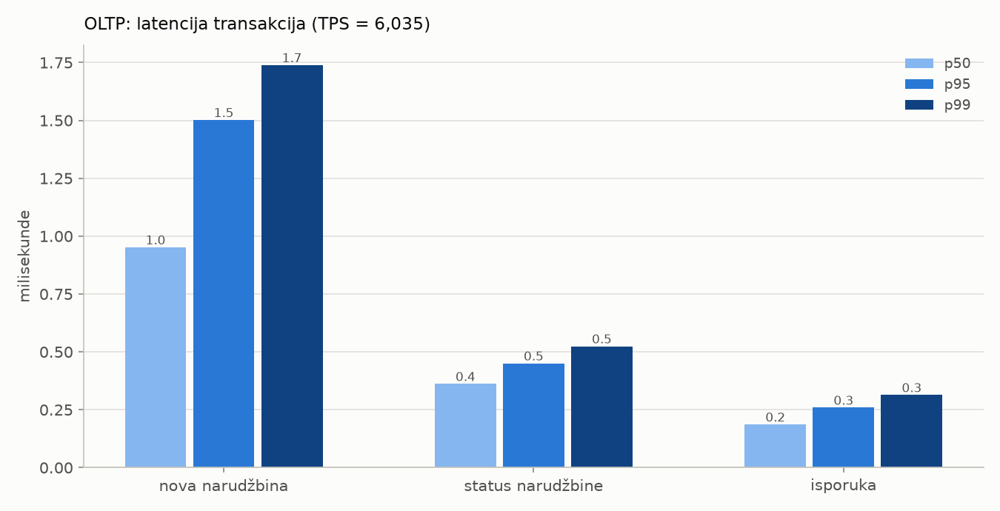
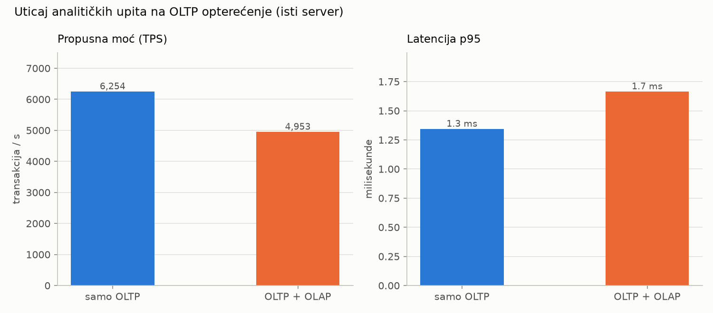
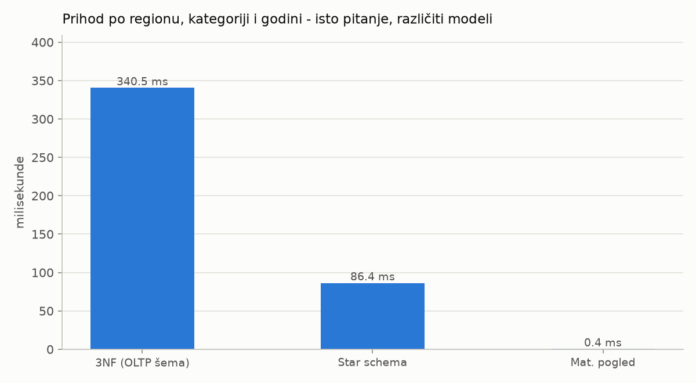
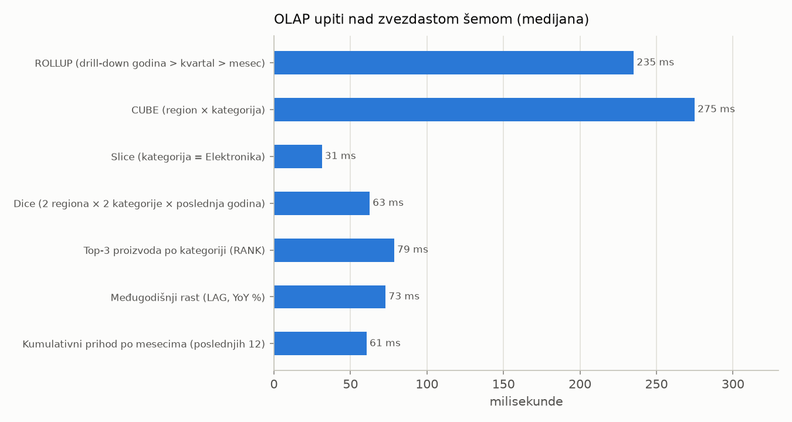

# OLTP i OLAP sistemi - rezultati

Datum: 30.09.2026 00:54 · PostgreSQL 18.4 · scale = 1.0 · 4 OLTP klijenata · 15 s po testu

## 1. OLTP šema (3NF)

| tabela | redova | veličina (sa indeksima) |
|---|---|---|
| oltp.order_item | 500,000 | 48.6 MB |
| oltp.orders | 200,000 | 40.5 MB |
| oltp.payment | 194,028 | 23.3 MB |
| oltp.customer | 20,000 | 3.4 MB |
| oltp.product | 2,000 | 240.0 kB |
| oltp.region | 4 | 80.0 kB |
| oltp.category | 8 | 80.0 kB |
| oltp.city | 17 | 64.0 kB |

## 2. OLTP opterećenje

- Potvrđenih transakcija: **90,536** za 15.0 s -> **6,035 TPS**
- Poništenih (ROLLBACK zbog nedovoljne zalihe): 8,276; deadlock: 0
- Latencija (sve transakcije): p50 0.39 ms, p95 1.40 ms, p99 1.62 ms

| transakcija | broj | prosek ms | p50 ms | p95 ms | p99 ms |
|---|---|---|---|---|---|
| nova_narudzbina | 49,445 | 0.92 | 0.95 | 1.50 | 1.74 |
| status_narudzbine | 29,609 | 0.37 | 0.36 | 0.45 | 0.52 |
| isporuka | 19,758 | 0.19 | 0.19 | 0.26 | 0.31 |

### Provera ACID svojstava

| provera | vrednost | rezultat |
|---|---|---|
| Konzistentnost: početna zaliha - trenutna = prodato | 198,807 = 198,807 | OK |
| Konzistentnost: nijedan proizvod nema negativnu zalihu | 0 proizvoda | OK |
| Atomičnost: nema narudžbine bez stavki ili bez uplate | 0 narudžbina | OK |
| Konzistentnost: orders.total = suma stavki | 0 odstupanja | OK |
| Izolacija: FOR UPDATE + fiksni redosled zaključavanja | 0 deadlock-a | OK |

## 3. Obrasci pristupa podacima

| upit | vreme | pročitano redova | blokova (8kB) | vraćeno | tip pristupa |
|---|---|---|---|---|---|
| OLTP: narudžbina po PK | 0.02 ms | 2 | 7 | 1.0 | Index Scan |
| OLTP: zaliha proizvoda | 0.01 ms | 1 | 3 | 1.0 | Index Scan |
| OLTP: poslednjih 5 narudžbina kupca | 0.03 ms | 14 | 10 | 5.0 | Bitmap Heap Scan, Bitmap Index Scan |
| OLAP: prihod po regionu/kategoriji/god. | 411.64 ms | 906,507 | 8,667 | 128.0 | Seq Scan |

## 4. ETL i skladište podataka

| ETL korak | redova | trajanje |
|---|---|---|
| Load dw.dim_date | 1,734 | 0.01 s |
| Load dw.dim_customer | 20,000 | 0.05 s |
| Load dw.dim_product | 2,000 | 0.00 s |
| Load dw.fact_sales (order_id 1..241169) | 584,407 | 5.12 s |
| Indeksi (BRIN date_key, B-tree product_key) + ANALYZE |  | 0.26 s |
| Materijalizovani pogled dw.mv_sales_month | 1,440 | 0.10 s |

Veličina `fact_sales`: 45.3 MB; BRIN indeks nad `date_key`: 24.0 kB; B-tree nad `product_key`: 4.0 MB.

## 5. OLAP upiti

**ROLLUP (drill-down godina > kvartal > mesec)** - Hijerarhija vremena: međuzbirovi po godini i kvartalu + ukupan zbir. (235.2 ms, 65 redova)

```sql
SELECT d.year, d.quarter, d.month, SUM(f.revenue) AS revenue

FROM dw.fact_sales f
JOIN dw.dim_date d     ON d.date_key = f.date_key
JOIN dw.dim_customer c ON c.customer_key = f.customer_key
JOIN dw.dim_product p  ON p.product_key = f.product_key

GROUP BY ROLLUP (d.year, d.quarter, d.month)
ORDER BY d.year NULLS LAST, d.quarter NULLS LAST, d.month NULLS LAST
```

**CUBE (region × kategorija)** - Sve kombinacije agregacije: region, kategorija, region×kategorija i ukupno. (275.0 ms, 45 redova)

```sql
SELECT c.region, p.category, SUM(f.revenue) AS revenue

FROM dw.fact_sales f
JOIN dw.dim_date d     ON d.date_key = f.date_key
JOIN dw.dim_customer c ON c.customer_key = f.customer_key
JOIN dw.dim_product p  ON p.product_key = f.product_key

GROUP BY CUBE (c.region, p.category)
ORDER BY c.region NULLS LAST, p.category NULLS LAST
```

**Slice (kategorija = Elektronika)** - Jedna vrednost jedne dimenzije -> 'isečak' kocke po regionu i godini. (31.4 ms, 16 redova)

```sql
SELECT c.region, d.year, SUM(f.revenue) AS revenue

FROM dw.fact_sales f
JOIN dw.dim_date d     ON d.date_key = f.date_key
JOIN dw.dim_customer c ON c.customer_key = f.customer_key
JOIN dw.dim_product p  ON p.product_key = f.product_key

WHERE p.category = 'Elektronika'
GROUP BY c.region, d.year
ORDER BY c.region, d.year
```

**Dice (2 regiona × 2 kategorije × poslednja godina)** - Podskup vrednosti više dimenzija -> 'kockica' po kvartalu. (62.6 ms, 16 redova)

```sql
SELECT c.region, p.category, d.quarter, SUM(f.revenue) AS revenue

FROM dw.fact_sales f
JOIN dw.dim_date d     ON d.date_key = f.date_key
JOIN dw.dim_customer c ON c.customer_key = f.customer_key
JOIN dw.dim_product p  ON p.product_key = f.product_key

WHERE c.region IN ('Beogradski region', 'Region Vojvodine')
AND p.category IN ('Elektronika', 'Sport')
AND d.year = (SELECT max(year) - 1 FROM dw.dim_date d2
WHERE d2.date_key IN (SELECT date_key FROM dw.fact_sales))
GROUP BY c.region, p.category, d.quarter
ORDER BY 1, 2, 3
```

**Top-3 proizvoda po kategoriji (RANK)** - Prozorska funkcija RANK() OVER (PARTITION BY kategorija). (78.6 ms, 24 redova)

```sql
SELECT category, product_name, revenue, rnk FROM (
SELECT p.category, p.product_name, SUM(f.revenue) AS revenue,
RANK() OVER (PARTITION BY p.category ORDER BY SUM(f.revenue) DESC) AS rnk

FROM dw.fact_sales f
JOIN dw.dim_date d     ON d.date_key = f.date_key
JOIN dw.dim_customer c ON c.customer_key = f.customer_key
JOIN dw.dim_product p  ON p.product_key = f.product_key

GROUP BY p.category, p.product_name) t
WHERE rnk <= 3
ORDER BY category, rnk
```

**Međugodišnji rast (LAG, YoY %)** - Poređenje sa prethodnom godinom pomoću LAG(). (73.0 ms, 32 redova)

```sql
SELECT category, year, revenue,
ROUND(100.0 * (revenue - LAG(revenue) OVER w) / LAG(revenue) OVER w, 1) AS yoy_pct
FROM (SELECT p.category, d.year, SUM(f.revenue) AS revenue

FROM dw.fact_sales f
JOIN dw.dim_date d     ON d.date_key = f.date_key
JOIN dw.dim_customer c ON c.customer_key = f.customer_key
JOIN dw.dim_product p  ON p.product_key = f.product_key

GROUP BY p.category, d.year) t
WINDOW w AS (PARTITION BY category ORDER BY year)
ORDER BY category, year
```

**Kumulativni prihod po mesecima (poslednjih 12)** - SUM() OVER (ORDER BY ...) - tekući zbir; filter po date_key koristi BRIN indeks. (60.6 ms, 13 redova)

```sql
SELECT d.year, d.month, SUM(f.revenue) AS revenue,
SUM(SUM(f.revenue)) OVER (ORDER BY d.year, d.month) AS cumulative

FROM dw.fact_sales f
JOIN dw.dim_date d     ON d.date_key = f.date_key
JOIN dw.dim_customer c ON c.customer_key = f.customer_key
JOIN dw.dim_product p  ON p.product_key = f.product_key

WHERE f.date_key >= to_char(current_date - interval '12 months', 'YYYYMMDD')::int
GROUP BY d.year, d.month
ORDER BY d.year, d.month
```

### Isto pitanje nad različitim modelima

| model | vreme (medijana) | broj spajanja | redova |
|---|---|---|---|
| 3NF (OLTP šema) | 340.5 ms | 6 | 128 |
| Star schema | 86.4 ms | 3 | 128 |
| Mat. pogled | 0.4 ms | 0 | 128 |

Rezultati su identični.


## 6. Interferencija OLTP i OLAP opterećenja

| scenario | TPS | p50 ms | p95 ms | p99 ms | OLAP upita |
|---|---|---|---|---|---|
| samo OLTP | 6,254 | 0.35 | 1.35 | 1.60 | - |
| OLTP + OLAP | 4,953 | 0.43 | 1.67 | 2.08 | 44 |

Pad propusne moći: **21%**, p95 latencija **×1.2**.

## 7. Inkrementalni ETL

|  | OLTP narudžbina danas | OLTP prihod danas | DW narudžbina danas | DW prihod danas |
|---|---|---|---|---|
| pre ETL-a | 98,829 | 7,862,542,365 | 41,169 | 3,529,083,260 |
| posle ETL-a | 98,829 | 7,862,542,365 | 98,829 | 7,862,542,365 |

| load | tip | od order_id | do order_id | redova |
|---|---|---|---|---|
| 1 | FULL | 0 | 241169 | 584,407 |
| 2 | INCREMENTAL | 241169 | 298829 | 125,013 |

Inkrementalni ETL: 1.26 s; osvežavanje materijalizovanog pogleda: 0.11 s.

## 8. OLTP vs OLAP - sažetak merenja

| osobina | OLTP | OLAP |
|---|---|---|
| Tipična operacija | INSERT/UPDATE/SELECT - čita 2 red(a) | agregacija - čita 906,507 redova |
| Broj operacija | 6,035 transakcija/s | 8.6 upita/s (1 nit) |
| Latencija | p50 0.39 ms | prosek 117 ms po upitu |
| Model podataka | 3NF (normalizovan) | star schema (denormalizovan) |
| Blokova (8 kB) po upitu | 7 | 8,667 |
| Pristup podacima | Index Scan po ključu | Seq Scan + Hash Join + agregacija |
| Svežina podataka | trenutna | do poslednjeg ETL-a |

## 9. Fajlovi

- `rezultati.csv` - sirovi rezultati
- `olap_rezultati.txt` - kompletni rezultati OLAP upita
- `grafik_oltp_latencija.png`


- `grafik_interferencija.png`


- `grafik_3nf_vs_star.png`


- `grafik_olap_upiti.png`


